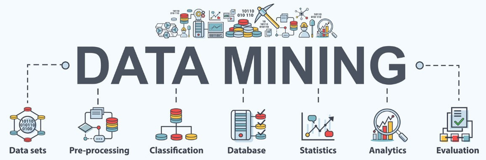

# IF998 - Soluções em Mineração de Dados

Prof. Leandro Almeida (lma3@cin.ufpe.br)



A mineração de dados se refere a uma etapa do processo de descoberta de
padrões em bases de dados. Esses padrões podem ser apresentados em
formato de regras e/ou modelos úteis para o processo de tomada de decisões.
Independente da área, a aplicação de técnicas inteligentes que visem a
descoberta de padrões úteis em bases de dados é cada vez mais necessária.

<br>

```
O objetivo desta disciplina é apresentar os principais conceitos, problemas, algoritmos e ferramentas relacionados à área. Serão estudados conceitos
básicos de Inteligência Artificial, Aprendizagem de Máquina, Metodologias de Análises experimentais e ferramentas para extração de diferentes tipos de
regras e padrões utilizando scripts em Python.
```

## Ementa

- Descoberta de padrões (Mineração de Dados): O que é, Origem, Motivação, Tarefas e Aplicações;
- Dados e Problemas: Tipos de Dados, Análise Exploratória dos Dados, Processamento, Limpeza, Transformação, Representação;
- Tarefas de Mineração de Dados: Aprendizagem, Classificação, Regressão, Associação e Agrupamentos;
- Metodologias e Técnicas de descoberta de conhecimento: CRISP-DM, Máquinas de Vetores de Suporte, Árvores de Decisão, Redes Neurais, K-vizinhos Mais Próximos, K-médias, Ensembles e tratamento de Dados Desbalanceados;

<br>

# Missões

| Missão nº | Descrição            | File                                                                                                                        |
| --------- | -------------------- | --------------------------------------------------------------------------------------------------------------------------- |
| #2        | Tipos de dados e EDA | [02_Tipos_de_dados_e_EDA.ipynb](https://github.com/Gustanascimento/if998-mineracao/blob/main/02_Tipos_de_dados_e_EDA.ipynb) |
| #3        | Preparação dos Dados | [03_Preparacao_dos_dados.ipynb](https://github.com/Gustanascimento/if998-mineracao/blob/main/03_Prepara%C3%A7%C3%A3o_dos_dados.ipynb) |
| #x        | --------             | [--------](https://github.com/Gustanascimento/if998-mineracao/)                                                             |

<br>
<br>
<br>

## Bibliografia

- _Extração de Conhecimento de Dados – Data Mining (segunda edição). João Gama, André Ponce de Leon Carvalho, Katti Faceli, Ana Carolina Lorena, Márcia Oliveira. Edições Silabo, 2015._
